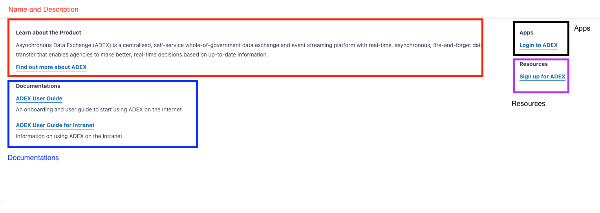

# Repository to Update Details Shown on Widget
A place for product teams to configure details to be shown on the dev console widget.

## Prerequisites
The only prerequisite is that you must have been onboarded by the dev portal team. During onboarding, we will just need these items:
- [ ] svg file of your project's logo icon
- [ ] github usernames of your team or members that you want to assign as code reviewers. Code owners should have been added here https://confluence.ship.gov.sg/display/DEV/Dev+Console+Widget+Links. Check `Code Owners` portion below for more info on this.

**If your product has not been onboarded, please fill up this [form](https://form.gov.sg/62b956943695530011a072d0).**
## How It Works

Changes to the `main` branch in this repo will throw a webhook to api gateway in AWS, which will then invoke lambda function to update s3 bucket holding all of the latest product details json files.

Widget then consumes these updated details through REST API calls.

It's good to know that `main` branch in this repo is updating the details in console's `prod` environment. There are also `stg` and `dev` branches that will deploy changes to console widget's own `stg` and `dev` environments. If you'd like to see your changes in dev console widget's `stg` and `dev`, you can merge to these branches. But generally, a pull request to `main` branch already creates a preview via AWS Amplify and it should be enough.

> This repository will be the single source of truth for product details displayed on widget.

## Usage Guide

1. Create a branch out of main.
2. Find your project's json files in `products-details/` folder.
3. Edit accordingly (refer to the `Recommended Practices for Editing Product Details` portion below).
4. Create a PR against main branch and see preview of your changes with the amplify link provided in the PR itself.
5. Code Owners will be notified of PR and if all's well, merge to main.
6. Ensure changes are reflected on the widget. It may take awhile for changes to take place.

> To check whether the changes were made successfully, do consider joining the slack channel https://gahmen.slack.com/archives/C03KJCGT6E5.


## Code Owners

Every json file will have owner(s) assigned so that PRs with changes to a particular file will automatically assign owner(s) as reviewers.

For e.g if John is owner of `/products-details/test.json` then if a PR contains changes to `/products-details/test.json`, John will automatically be assigned as reviewer.

Details of code owners can be viewed in `CODEOWNERS` file. By default, if any changes to files outside of `/products-details/` folder were to happen, Dev Portal team will be the reviewer.

To learn more on how `CODEOWNERS` in github work check out [this link](https://docs.github.com/en/repositories/managing-your-repositorys-settings-and-features/customizing-your-repository/about-code-owners)

> Code owners are file name specific so if a file's name is changed, do rmbr to make a change in CODEOWNERS file in the PR as well.

## Recommended Practices for Editing Product Details

The widget details has a few portion([See live here](https://docs.developer.tech.gov.sg/)): 



```json
{
    "name": "ADEX",
    "uniqueKey": "adex",
    "description": "Asynchronous Data Exchange (ADEX) is a centralised, self-service whole-of-government data exchange and event streaming platform with real-time, asynchronous, fire-and-forget data transfer that enables agencies to make better, real-time decisions based on up-to-date information.",
    "url": "https://www.developer.gov.sg/products/categories/sensor-platforms-and-internet-of-things/asynchronous-data-exchange/overview.html",
    "documentations": [
      {
        "name": "ADEX User Guide",
        "description": "An onboarding and user guide to start using ADEX on the Internet",
        "url": "https://docs.developer.tech.gov.sg/docs/adex-user-guide"
      },
      {
        "name": "ADEX User Guide for Intranet",
        "description": "Information on using ADEX on the Intranet",
        "url": "https://docs.developer.tech.gov.sg/docs/adex-user-guide-for-intranet"
      }
    ],
    "apps": [
      {
        "name": "Login to ADEX",
        "url": "https://adex.gov.sg/auth/login;app=sdx"
      }
    ],
    "resources": [
        {
            "name": "Sign up for ADEX",
            "url": "https://adex.gov.sg/auth/signup;app=sdx/create-account"
        }
    ]
}
```
> Unique key will not be displayed on the details portion.

### Name and Description

Name and description of the product and a link to product's details page in developer portal.

### Documentations

Any technical documentations that you would like users to have access to accompanied by a short description.


> a) Tech documents will need to be published on the Singapore Government Developer Portal (Dev Portal). <br/>
> b) The description provided for each document will need to be the same as what is provided on the Dev Portal.

### Apps

Links to applications that you would like viewers to have access to through this widget. It will only bring user to the page provided, it will not do any other actions such as actual login.

### Resources

Other misc resources that you think is important that the user should know.

> Height of the details portion is fixed, so if there are too many links, it will overflow and may not look as good. Do try to curate and limit the number of links you display for each portion.


